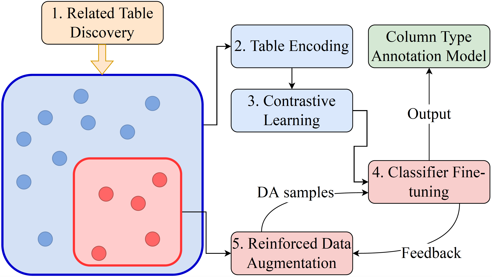

# CORDA

This is the GitHub repository for the CORDA model. CORDA model enhances the annotation performance of the column semantic types by jointly encoding both intra- and inter-table context information as well as fully utilizing both labeled and unlabeled data.



## Requirements

The setup of the environment is similar to that of [Sudowoodo's](https://github.com/megagonlabs/sudowoodo/tree/main)

* Python 3.7.10
* PyTorch 1.9.0+cu111
* Transformers 4.9.2
* NVIDIA Apex

We can install the required packages with:
```console
$ conda create --name CORDA python=3.7.10
$ conda activate CORDA
$ pip install -r requirements.txt
$ git clone https://github.com/NVIDIA/apex.git
$ pip install -v --disable-pip-version-check --no-cache-dir ./apex
```

## Reproduce the results
In order to reproduce the results on the Semtab2019 dataset, please go through the following steps:
1. Download the pre-processed related table data following the instructions provided in [semtab_data](https://github.com/ysunbp/CORDA/tree/main/semtab_data).
2. Run run-epida-rl-inner-semtab.py file.
3. The checkpoints will be stored in the [semtab_checkpoints](https://github.com/ysunbp/CORDA/tree/main/semtab_checkpoints) folder.

In order to reproduce the results on the WebTables dataset, please go through the following steps:
1. Download the pre-processed related table data following the instructions provided in [sato_data](https://github.com/ysunbp/CORDA/tree/main/sato_data).
2. Run run-epida-rl-inner.py file.
3. The checkpoints will be stored in the [sato_checkpoints](https://github.com/ysunbp/CORDA/tree/main/sato_checkpoints) folder.
